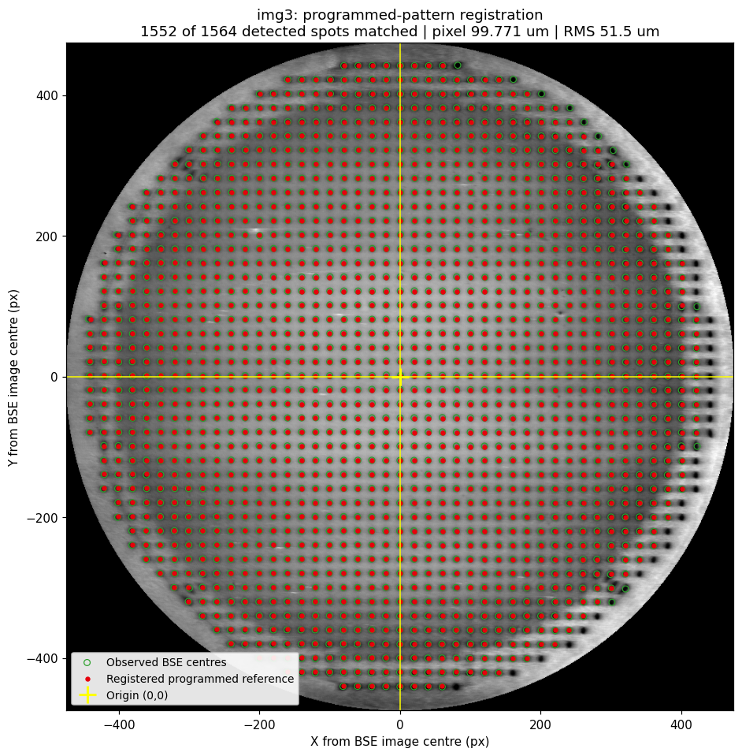
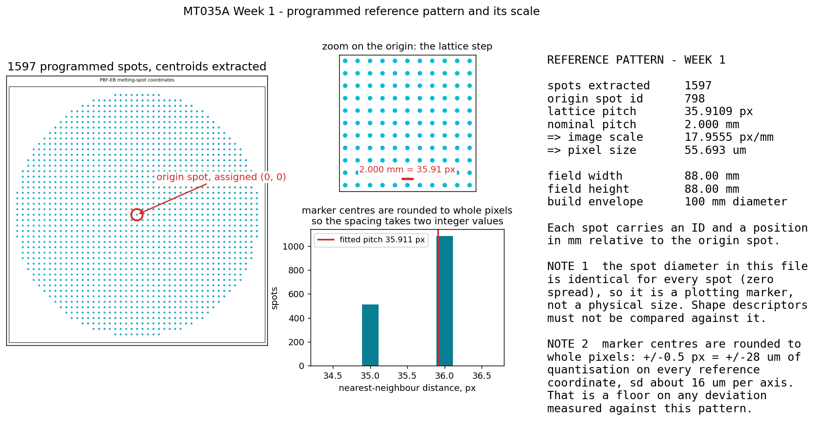
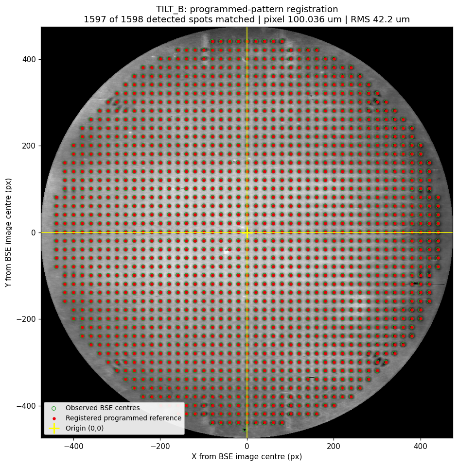
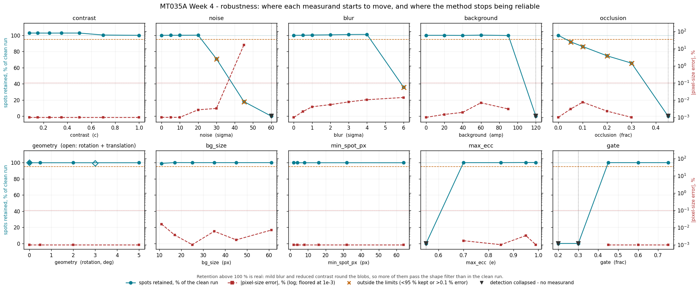

# BSE calibration-pattern analysis for PBF-EB

Automatic measurement of how far a melted calibration pattern has drifted from
the pattern the machine was programmed with, from a single backscattered-
electron (BSE) image.

The electron beam in a PBF-EB machine is both the tool and the probe: the same
deflection system melts the powder and forms the BSE image. Melting a known
lattice on a plate and imaging it therefore gives a direct check on beam
positioning — but that check is normally done by eye, which is slow and depends
on who is doing it. This code does it automatically and returns numbers you can
trend.

Written for the group project in **MT035A, Additive Manufacturing in Metal,
Mid Sweden University, HT2026**. Course-mates: clone it, drop the course images
in, run `./run_all.sh`.

---

## Does the registration hold up?

The programmed pattern after the fitted transform (red), on the untouched BSE
image, with the detected spot centres (green). Origin at the image centre.




The four panels of the workflow, on one region of one plate — original,
background removed, identified geometry, registered overlay:


---

## What it measures

Given a BSE snapshot and the programmed pattern, it fits

```
[x', y'] = s · R(θ) · [x, y] + [tx, ty]
```

| measurand | where it comes from |
|---|---|
| ΔX, ΔY | translation of the pattern origin |
| Δθ | rotation — only defined modulo 90°, because a square lattice is 4-fold symmetric |
| scale s | and with it the **derived BSE pixel size**, which is an output, not an input |
| local distortion | the per-spot residual left after the fit is removed |
| radial / tangential | components of that residual about the centre of the field |

Four degrees of freedom is deliberately few. The model cannot describe an
anisotropic scale, a shear, perspective from a tilted plate, barrel or
pincushion distortion, or a per-spot placement error — all of which therefore
stay in the residual, which is exactly where the distortion measure comes from.
A richer model would absorb the defect into the fit and make the machine look
better than it is. `bse_register.py` also reports a six-parameter affine fit as
a standing diagnostic, so the question of whether the extra freedom is needed is
answered by the data: anisotropy is 0.07–0.12 % and shear under 0.05° on every
image measured, so it is not.

---

## Results

Five images: three flat plates and two tilted ones.

| image | matched of 1597 | pixel size | Δθ (mod 90°) | residual RMS | affine anisotropy |
|---|---|---|---|---|---|
| flat 1 | 1481 | 99.9803 µm | −0.0200° | 55.6 µm | +0.093 % |
| flat 2 | 1500 | 99.9804 µm | −0.0108° | 51.6 µm | +0.076 % |
| flat 3 | 1552 | 99.7708 µm | +0.0564° | 51.5 µm | +0.101 % |
| tilted A | 1503 | 99.9924 µm | −0.0105° | 52.4 µm | +0.063 % |
| tilted B | 1597 | 100.0358 µm | −0.0028° | 42.2 µm | +0.092 % |

### Why the registration can be believed

- **Independent images agree on the scale to better than 0.1 %.** Nothing in
  the pipeline takes a pixel size as input; it falls out of fitting a 2.000 mm
  lattice to the observed spots. The first two flats agree to **1.0 ppm**
  (10.001970 against 10.001960 px/mm). They agreed to 82 ppm before the
  rotation seed and the second pass; the fit is now constrained by about 1500
  spots per image instead of about 1300.
- **All five land within 0.25 % of a round 100 µm/px**, which is what a
  hardware setting would be. We did not tune anything towards that number.
- **The residual is far below one lattice step.** A median of 36 µm against a
  2000 µm pitch is 1.8 %. Had any spot been matched to the wrong lattice node
  it would deviate by close to 2000 µm; the largest deviation anywhere is
  353 µm.
- **A second, independently written pipeline agrees.** Run with its own
  calibration disabled, a course-mate's separate implementation gives
  10.006 / 10.003 / 10.026 px/mm where this one gives 10.003 / 10.002 / 10.022
  — agreement to 0.04 %. The two codebases also agree on the reference lattice
  pitch to 4 × 10⁻⁵ (35.9109 px here, 35.9122 px there).
- **`selftest.py` recovers a transform it was given.** On synthetic data with a
  known scale, rotation and shift the pipeline returns them to 0.004 %,
  0.0007° and 0.02 px, under clean, low-contrast, noisy, blurred and strongly
  shaded conditions.



### Two defects found in the supplied reference

**Its millimetre columns are wrong by 0.25 %.** They assume a round
18.000 px/mm, while the lattice actually sits at 35.9109 px, i.e.
17.9555 px/mm. Taking them at face value stretches the pattern by 0.25 % and
puts that error straight into the derived pixel size. `load_reference()`
therefore ignores those columns and re-derives millimetres from the pixel
columns against the nominal pitch. Two checks confirm it: the field then
measures exactly 88.000 mm (44 steps × 2.000 mm), and the derived BSE pixel
size moves from 99.72 µm to 99.97 µm — 0.03 % from a round 100 µm/px instead
of 0.28 %.

**Its coordinates are quantised to whole pixels.** Every marker centre is an
integer, so nearest-neighbour distances take only the values 35 and 36 px and
never the true 35.911. That is ±0.5 px = ±28 µm, about 16 µm per axis — a floor
under any deviation measured against this pattern, and roughly half the
variance of the random component below.

A third, already known: the spot diameter is identical for all 1597 spots, so
it is a plotting marker and not a physical size. Shape descriptors must never
be compared against it.

### Note on the nominal pitch

Nothing in the supplied material states the lattice pitch. 2.000 mm is an
**inference**, and it is declared as one. What supports it: the lattice measures
35.911 px; at the stated 18 px/mm that is 1.9950 mm and the 44-step field is
87.78 mm, while at 2.000 mm the field is exactly 88.000 mm and the derived BSE
pixel size lands on a round 100 µm/px. Two independent numbers go round if the
pitch is 2.000 and neither does otherwise. It remains circumstantial; a caliper
across the melted pattern settles it — 88.0 mm against 85.9 mm is the test.

---

## What the cross-check changed

Three implementations of this task were written separately in the group and
then compared. Methods were adopted where they measured better on our own test
set, and only there.

**Adopted.**

* *Seed the rotation from the measured lattice angle.* Without it the fit
  starts from zero rotation and converges only while the pattern sits within
  about 2° of the reference axes. Beyond that the nearest-neighbour matching
  locks onto the wrong lattice node and the fit fails **while still reporting a
  plausible angle** — at 20° it returned a 0.079 % pixel-size error from a
  completely broken fit. The lattice angle is known modulo 90°, so all four
  candidates are tried and the one matching the most spots wins. The fit now
  holds to 0.008 % at 20°.
* *Split merged spots instead of discarding them.* Two touching spots form one
  elongated blob that the eccentricity filter throws away, losing both. A
  marker-based watershed on the local maxima of the flattened map cuts along
  the intensity valley and keeps both.
* *A predicted-position second pass.* The detector has to decide from the image
  alone that something is a spot, so it loses the faint ones, the merged ones
  and the ones near the rim. After the first fit the lattice is known, so every
  unmatched reference point has a predicted position and a window of a third of
  a pitch to search. On the weakest image this recovers 183 spots.

**Rejected, after measuring it.** A morphological black top-hat is the textbook
background removal and finds about 13 more spots on a clean snapshot. It is
also a local min–max operation, so it is noise-sensitive: at σ = 30 grey levels
it returns a confident **11.5 % pixel-size error** where the median filter is
still correct. Thirteen spots are not worth that, so the median stays the
default and `robustness.py` measures both.

**The guard this forced.** The second pass searches where the first fit says a
spot must be, so it confirms whatever lattice the first fit chose — including a
wrong one. Under noise it finds *something* at nearly every wrong position, so
an unguarded version came back from a broken fit with **more** matches than a
good one, destroying the matched fraction as a warning sign. The refinement is
therefore accepted only if it recovers no more than a fifth of the first pass's
matches, moves the scale by less than 0.1 %, and does not inflate the residual
on the spots the detector itself found. With the guard in place the pipeline
fails loudly again: at σ = 30 the match count drops to 1047 and the second pass
contributes nothing.

## Systematic or random?

A single image cannot tell: any residual left after a fit looks like a pattern.
Several independent snapshots can, because a machine-caused deviation repeats
while detection noise does not.


| | over 2 flats | over 3 flats |
|---|---|---|
| systematic | 16.1 µm | 16.8 µm |
| random | 46.6 µm | 45.0 µm |

The split is computed only over spots the **detector** found in every image —
1213 of the 1443 matched in both flats. A spot recovered by the second pass is
measured with a window centroid rather than a blob centroid, and pooling two
estimators with different scatters would inflate the random term and wash out
the systematic one. On an identical spot set the second pass improves the
random term from 71.7 µm to 50.9 µm and leaves the systematic term unchanged
at about 14 µm: it makes the lattice better determined, it does not invent
agreement.

Of the random part, about 16 µm per axis is the reference file's pixel
quantisation, leaving roughly 17–22 µm of genuine detection noise.

**Consequence for a limit.** A single image cannot resolve a drift below about
35 µm. Averaging N images pulls that floor down as 1/√N while the systematic
part stays put. Any warning limit tighter than that floor is measuring our own
noise.

---

## The tilted plate




**Foreshortening is not a tilt signature in this system.** One expects a tilted
plane to be compressed along the tilt axis, giving an anisotropic scale. The
measurement says otherwise: the tilted plates (+0.063 %, +0.092 %) sit inside
the spread of the flat ones (+0.093 %, +0.076 %, +0.101 %) — the two
populations do not separate at all. The reason is the
same fact the whole project rests on — the beam is deflected to a commanded
(x, y) and the BSE image is formed by the same deflection, so both the writing
and the reading use the same in-plane coordinates. Tilt changes the working
distance, that is the focus, not the geometry. Any tilt estimate has to come
from focus.

The left panel shows where each image's spot-area gradient points, the right
panel follows spot area along each image's own departure direction. A radial
average — the obvious thing to plot — hides all of it, because a tilt is
directional and averaging over angle destroys exactly the signal.

**The spots do not become measurably more oval.** The obvious shape metric
for a tilted plate is the aspect ratio of a spot, major axis over minor, which
is 1.000 for a circle. It does not separate the two populations either:

| plate | aspect ratio, median | 95th percentile | eccentricity, median |
|---|---|---|---|
| flat 1 | 1.162 | 1.440 | 0.509 |
| flat 2 | 1.095 | 1.298 | 0.406 |
| flat 3 | 1.171 | 1.466 | 0.520 |
| **tilted A** | **1.105** | **1.285** | **0.425** |
| **tilted B** | **1.087** | **1.232** | **0.392** |

Both tilted plates are *rounder* than two of the three flats. The metric is
reported because it is the natural one to ask for, and the honest answer is
that at these tilt angles it carries no information: the spread between
nominally identical flat plates is larger than any difference the tilt makes.
That is the same verdict as the affine anisotropy, and for the same physical
reason. The focus gradient below is the measurement that does separate them.

**A flat plate already varies, and the raw gradient separates nothing.** Spot
area has a directional gradient of 0.37–0.53 %/mm on a flat plate, because the
BSE detector sits to one side. The clearest demonstration is TILT_A: its raw
gradient, 0.219 %/mm, is the **smallest of all five images**, and it is the
plate with the largest genuine tilt signal. Ranking the raw numbers would put
it last. The flats are therefore averaged into a baseline (0.421 %/mm at 16.2°)
and subtracted vectorially, and what is left is compared against the
flat-to-flat scatter of 0.168 %/mm:

| plate | excess over the flat baseline | against the flat-to-flat floor |
|---|---|---|
| tilted A | 0.596 %/mm at 181° | **3.5×** |
| tilted B | 0.487 %/mm at 138° | **2.9×** |
| flat 3 | 0.239 %/mm at 299° | 1.4× |
| flat 2 | 0.217 %/mm at 108° | 1.3× |
| flat 1 | 0.050 %/mm at 178° | 0.3× |

Both tilted plates stand clearly above the floor and all three flats sit at or
below 1.4×, so the measurement separates the two populations — which the raw
gradient, the anisotropy and the radial profile all failed to do.

**No tilt angle is reported.** Converting %/mm of spot area into degrees needs
the beam's depth-of-focus characteristic — how spot area grows per millimetre
of working-distance error — which the supplied data does not contain. What the
data supports is a focus gradient across the plate, consistent with a tilt, of
the magnitudes above.

One thing worth flagging. The plate labelled *flat 3* has the largest excess
of the three flats, 1.4× the floor, and also the pixel size furthest from the
other two (99.771 µm against 99.980 µm). Neither is damning on its own — 1.4×
is inside the flat population — but the two anomalies point the same way, so
its provenance is worth a question to the teacher rather than a claim from us.

The positional measurement is untroubled by tilt: the tilted plates register
normally, and tilted B has the lowest residual and the most complete match of
all five images (1597 of 1597). Tilt degrades focus, not the coordinate
check.

---

## Robustness



Three conventions in this figure are worth stating, because the first version
of it got each of them wrong. A run that found no spots has no pixel size, so
it carries a marker on the axis and no red point — plotting a zero error there
turned a total failure into a perfect score. Failing runs are marked one at a
time rather than by shading a span from the first failure to the edge of the
axis, which condemned whole usable ranges. And retention above 100 % is real,
not a bug: mild blur and reduced contrast round the blobs, so **more** of them
pass the shape filter than in the clean run — the clean run is not the best
detection this pipeline can do.

`robustness.py` re-runs the whole pipeline on a real snapshot under controlled
degradations and parameter changes, one at a time. Of 61 runs, 48 stayed inside
both limits and 54 remained accurate on whatever spots survived. Two criteria are kept apart
on purpose: **completeness** (are the spots still there — 95 % of what a clean
run finds) and **accuracy** (is the fit built from whatever survived still
right — pixel size within 0.1 %, angle within 0.05°). Both thresholds are a
proposal, not values given in the data. An occlusion removes spots by
construction, so it fails completeness while staying accurate; that distinction
matters for a limit.

| variation | reliable to | first failure | what fails first |
|---|---|---|---|
| contrast compression | **12× reduction** | never in range | — |
| additive noise | σ = 20 grey levels | σ = 30 | completeness (71 %) |
| blur | σ = 4 px | σ = 6 | completeness (36 %) |
| background ramp | 90 grey levels | 120 | pipeline collapses |
| background filter width | **11–61 px** | never in range | — |
| minimum blob area | 2–64 px | never in range | — |
| eccentricity limit | 0.70–0.99 | 0.55 | pipeline collapses |
| match gate | 0.45–0.75 × pitch | 0.30 | pipeline collapses |
| known rotation | **0–5°, and 3° with a 27 px shift** | never in range | — |

**Contrast is a non-issue** — compressing grey values twelvefold changes
nothing, because the flatten-and-subtract step normalises the background away
before Otsu sees the image. **Noise is the tightest constraint.** **Parameter
choices are not delicate**: every parameter here can be moved over its whole
swept range without the pixel size leaving ±0.016 %, and the background filter
and the minimum blob area never break the method at all.

**Accuracy outlives completeness.** Wherever the pipeline fails in this sweep
it fails by losing spots, not by returning a wrong number: at blur σ = 6 only
36 % of the spots survive, and the pixel size from those is still right to
0.014 %. Occlusion is the clearest case — it removes spots by construction, so
every occlusion run fails completeness while the fit on what remains stays
accurate to better than 0.008 %. The one exception is heavy noise, σ ≥ 45,
where the fit itself breaks down; there the match count has already collapsed
to 18 %, so the failure announces itself.

**The weakness this test found, and the fix it forced.** The first version of
this sweep showed the fit failing at a known 5° rotation — returning a
plausible-looking angle from a broken solution, with the matched fraction
dropping to 65 % as the only clue. The cause was that ICP started from the
identity rotation, so beyond about 2° the outer spots were displaced by more
than the half-pitch gate and matched to the wrong lattice node. Seeding the
rotation from the measured lattice angle removes it: the rotation family is now
6/6 reliable, 5° comes back with a 0.0005 % pixel-size error and a full match,
and a 3° rotation combined with a 27 px translation costs 0.004 %. The sweep is
in the repository because it found this, not to show that nothing is wrong.

---

## Proposed quality-assurance routine

*Limits are a proposal. None are given in the data.*

**When.** After any beam-calibration change, after a column or detector
service, and as a scheduled monthly check. Repeat at two heights when the build
envelope is used fully.

**Retain.** The raw BSE image, the reference file and its version, the software
version and parameter set, the per-spot deviation table, and the one-line fit
summary. That is what makes a past result re-auditable.

**Trend.** Derived pixel size, Δθ, ΔX/ΔY, residual RMS and 95th percentile, and
the matched-spot fraction — per machine, as a control chart, not pass/fail on a
single reading.

**Limits (proposed).** Warn at residual RMS above 75 µm or a matched fraction
below 95 % of the machine's own baseline. Act at RMS above 120 µm, |Δθ| above
0.05°, or a pixel-size shift above 0.3 % from the trend.

**Act.** Re-image first — half the deviation is measurement noise. If it
repeats, re-run beam calibration and re-measure. If the pixel size has moved,
suspect imaging geometry rather than the beam. If too few spots match, fix
image quality first, because every other number is then unreliable.

---

## What it cannot verify

A finished part being dimensionally correct — a flat plate is not a part.
Anything about melt-pool behaviour, layer bonding, porosity or microstructure.
The Z axis, powder spreading or thermal history. This is a single-layer,
in-plane geometric check.

**Complementary control.** A physically measured artefact: built, then verified
off-machine by CMM or CT against known nominal dimensions. That closes the loop
the pattern cannot — registration against the machine's own BSE image cannot
detect a deflection-gain error at all, because the same deflection writes the
pattern and scans the image, so such an error cancels in the machine's own
coordinates. Only an external physical reference reveals it.

---

## Running it

```bash
python3 -m venv .venv && source .venv/bin/activate
pip install -r requirements.txt

python3 selftest.py        # synthetic ground truth, no course data needed
```

The course images are not in this repository — they belong to the teaching
team. Put them in the root (they are in `.gitignore`) and:

```bash
./run_all.sh                       # weeks 1-3 and every figure
./run_all.sh --sweep               # the above plus the Week-4 sweep (minutes)
./run_all.sh image1.png image2.png # or just the snapshots you name
```

`run_all.sh` runs the self-test first, so a broken pipeline fails before it
produces numbers that look plausible. The Week-4 sweep is behind a flag only
because it re-runs the whole pipeline 61 times; `python3 robustness.py
--plot-only` redraws its figure from the stored `week4-robustness.csv`.

| script | what it does |
|---|---|
| `bse_register.py` | detection, registration, every measurand, affine diagnostic |
| `make_registration_overlay.py` | the overlay above, plus a per-spot table |
| `analyse_repeatability.py` | systematic versus random, over any number of images |
| `focus_profile.py` | spot area, diameter and eccentricity against radius |
| `tilt_analysis.py` | tilt against a flat-plate baseline |
| `check_orientation.py` | resolves the 90° lattice ambiguity |
| `robustness.py` | controlled degradations and parameter sweeps |
| `selftest.py` | synthetic ground-truth check |
| `run_all.sh` | reproduces every result and figure in this README |
| `make_reference_figure.py`, `make_workflow_figure.py`, `make_slide_overlay.py` | figures |

### Output columns

`<image>-deviations.csv`, one row per matched spot: `ref_idx`, `obs_idx`,
`ref_x_mm`, `ref_y_mm`, `pred_x_px`, `pred_y_px`, `obs_x_px`, `obs_y_px`,
`obs_x_mm`, `obs_y_mm` (observed centre in the BSE image's **own**
calibration), `dx_um`, `dy_um`, `dist_um`, `radius_mm`, `dev_radial_um`,
`dev_tangential_um`, `lattice_i`, `lattice_j`, `aspect_ratio`,
`eccentricity`, `detected`.

`lattice_i` and `lattice_j` are the spot's identity on the pattern, not a row
number: the reference spot is (0, 0), its neighbour one pitch along +x is
(1, 0), one along +y is (0, 1), and the pattern runs from (−22, −22) to
(22, 22). All 1597 reference spots get a distinct pair, and the largest
distance between a spot and the node it was assigned to is 0.014 of a pitch —
printed on every run, because anything near 0.5 would mean a spot had been
given the wrong identity and every comparison built on these IDs would be
quietly wrong. Keying on (i, j) is what lets a spot be followed between
images, and between the three implementations in the group.

`aspect_ratio` and `eccentricity` are blank for a spot recovered by the second
pass: it has a measured position but no blob, so its shape is undefined, and a
blank is written rather than a zero.

`<image>-summary.csv`, one row per image, adds the affine diagnostic and the
shape statistics.

`<image>-matched_spot_residuals.csv` carries the same per-spot data in the
column order the rest of the group is using, so tables from different pipelines
line up row for row.

---

## Limitations

- Three flat plates and two tilted ones. Not a qualified measurement procedure.
- The derived pixel size rests on the nominal lattice pitch being true, which
  is inferred and not stated anywhere in the supplied material.
- Spots near the rim are measured less reliably — contrast falls off and some
  are clipped by the erosion margin. Part of the growth of the residual towards
  the edge is probably this, not the machine.
- The fit must not be trusted on an image rotated more than about 2° from the
  reference until the initialisation is seeded from the measured lattice angle.
- `check_orientation.py` reports INCONCLUSIVE when the four quarter turns score
  within 20 % of each other, which they do for images of very different
  character. Use the marked reference spot to fix orientation instead.

## Sources

- Umeyama, S. (1991). Least-squares estimation of transformation parameters
  between two point patterns. *IEEE TPAMI* 13(4), 376–380.
- Besl, P. & McKay, N. (1992). A method for registration of 3-D shapes.
  *IEEE TPAMI* 14(2), 239–256.
- Otsu, N. (1979). A threshold selection method from gray-level histograms.
  *IEEE Trans. SMC* 9(1), 62–66.
- van der Walt, S. et al. (2014). scikit-image: image processing in Python.
  *PeerJ* 2:e453.
- ISO/ASTM 52930 and ISO/ASTM 52920.

## Who did what

See [`CONTRIBUTIONS.md`](CONTRIBUTIONS.md), which also records the two
disagreements between the group's three independent implementations and how
each was resolved.

## License

MIT — see [LICENSE](LICENSE). The course data is not covered by it and is not
included here; the figures above are our own analysis output.
