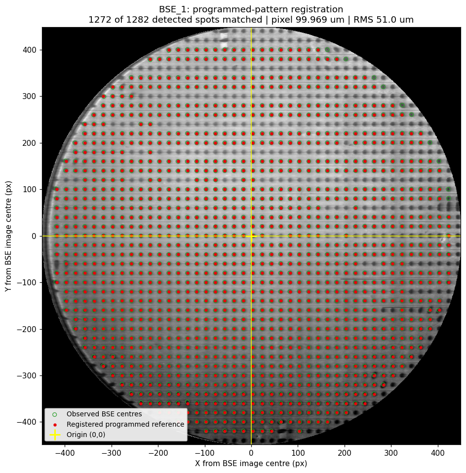
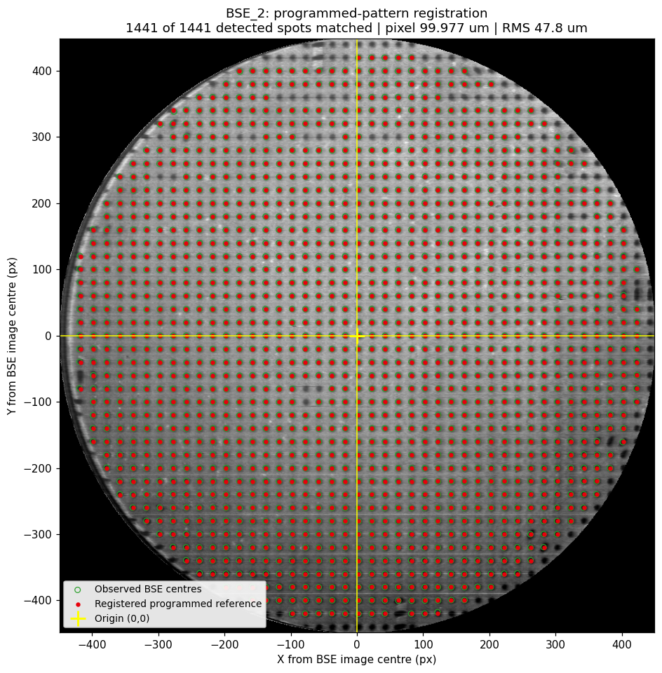
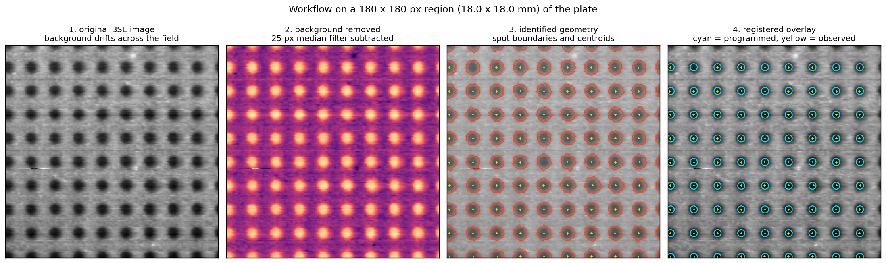
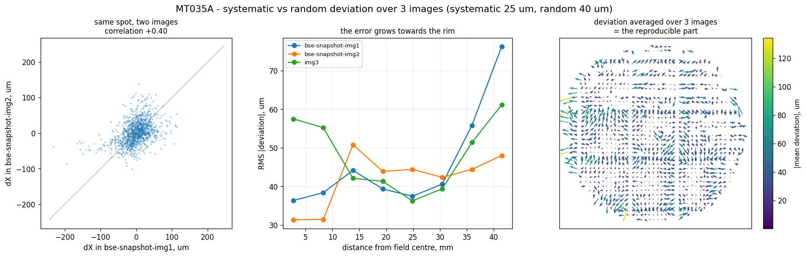
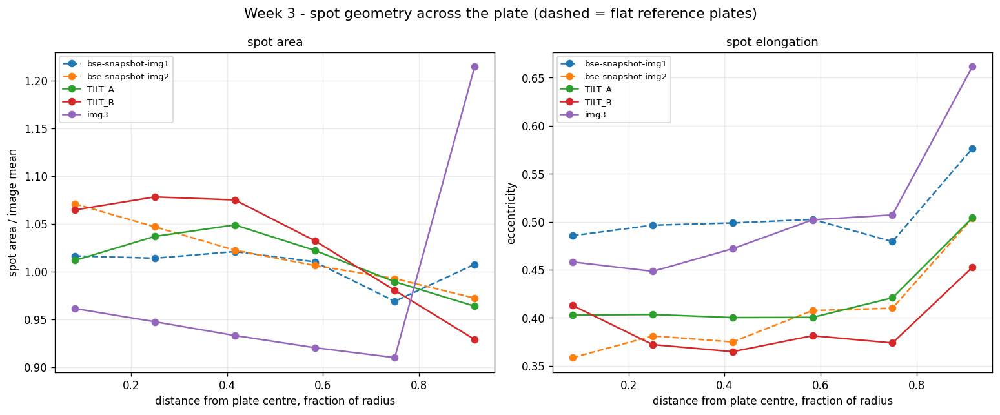
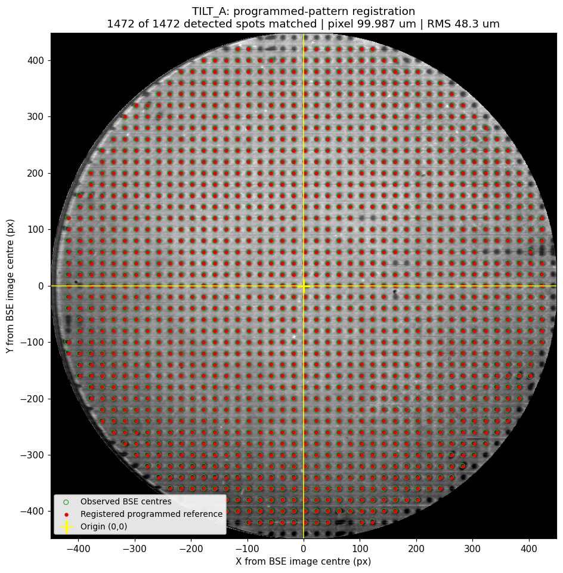

# BSE calibration-pattern analysis for PBF-EB

Automatic measurement of how far a melted calibration pattern has drifted from
the pattern the machine was programmed with, from a single backscattered-
electron (BSE) image.

The electron beam in a PBF-EB machine is both the tool and the probe: the same
deflection system melts the powder and forms the BSE image. Melting a known
lattice on a plate and imaging it therefore gives a direct check on beam
positioning — but that check is normally done by eye, which is slow and depends
on who is doing it. This code does it automatically and returns numbers you can
trend.

Written for the group project in **MT035A, Additive Manufacturing in Metal,
Mid Sweden University, HT2026**. Course-mates: clone it, drop the course images
in, run `./run_all.sh`.

---

## Does the registration hold up?

The programmed pattern after the fitted transform (red), on the untouched BSE
image, with the detected spot centres (green). Origin at the image centre.




The four panels of the workflow, on one region of one plate — original,
background removed, identified geometry, registered overlay:



---

## What it measures

Given a BSE snapshot and the programmed pattern, it fits

```
[x', y'] = s · R(θ) · [x, y] + [tx, ty]
```

| measurand | where it comes from |
|---|---|
| ΔX, ΔY | translation of the pattern origin |
| Δθ | rotation — only defined modulo 90°, because a square lattice is 4-fold symmetric |
| scale s | and with it the **derived BSE pixel size**, which is an output, not an input |
| local distortion | the per-spot residual left after the fit is removed |
| radial / tangential | components of that residual about the centre of the field |

Four degrees of freedom is deliberately few. The model cannot describe an
anisotropic scale, a shear, perspective from a tilted plate, barrel or
pincushion distortion, or a per-spot placement error — all of which therefore
stay in the residual, which is exactly where the distortion measure comes from.
A richer model would absorb the defect into the fit and make the machine look
better than it is. `bse_register.py` also reports a six-parameter affine fit as
a standing diagnostic, so the question of whether the extra freedom is needed is
answered by the data: anisotropy is 0.07–0.12 % and shear under 0.05° on every
image measured, so it is not.

---

## Results

Five images: three flat plates and two tilted ones.

| image | detected | matched | pixel size | Δθ (mod 90°) | residual RMS | affine anisotropy |
|---|---|---|---|---|---|---|
| flat 1 | 1282 | 1272 | 99.969 µm | −0.0119° | 51.0 µm | +0.121 % |
| flat 2 | 1441 | 1441 | 99.977 µm | −0.0090° | 47.8 µm | +0.087 % |
| flat 3 | 1456 | 1444 | 99.783 µm | +0.0553° | 49.6 µm | +0.114 % |
| tilted A | 1472 | 1472 | 99.987 µm | −0.0112° | 48.3 µm | +0.065 % |
| tilted B | 1586 | 1585 | 100.035 µm | −0.0031° | 42.0 µm | +0.093 % |

### Why the registration can be believed

- **Independent images agree on the scale to better than 0.1 %.** Nothing in
  the pipeline takes a pixel size as input; it falls out of fitting a 2.000 mm
  lattice to the observed spots. The first two flats agree to 82 ppm.
- **All five land within 0.25 % of a round 100 µm/px**, which is what a
  hardware setting would be. We did not tune anything towards that number.
- **The residual is far below one lattice step.** A median of 36 µm against a
  2000 µm pitch is 1.8 %. Had any spot been matched to the wrong lattice node
  it would deviate by close to 2000 µm; the largest deviation anywhere is
  353 µm.
- **A second, independently written pipeline agrees.** Run with its own
  calibration disabled, a course-mate's separate implementation gives
  10.006 / 10.003 / 10.026 px/mm where this one gives 10.003 / 10.002 / 10.022
  — agreement to 0.04 %. The two codebases also agree on the reference lattice
  pitch to 4 × 10⁻⁵ (35.9109 px here, 35.9122 px there).
- **`selftest.py` recovers a transform it was given.** On synthetic data with a
  known scale, rotation and shift the pipeline returns them to 0.004 %,
  0.0007° and 0.02 px, under clean, low-contrast, noisy, blurred and strongly
  shaded conditions.

### Two defects found in the supplied reference

**Its millimetre columns are wrong by 0.25 %.** They assume a round
18.000 px/mm, while the lattice actually sits at 35.9109 px, i.e.
17.9555 px/mm. Taking them at face value stretches the pattern by 0.25 % and
puts that error straight into the derived pixel size. `load_reference()`
therefore ignores those columns and re-derives millimetres from the pixel
columns against the nominal pitch. Two checks confirm it: the field then
measures exactly 88.000 mm (44 steps × 2.000 mm), and the derived BSE pixel
size moves from 99.72 µm to 99.97 µm — 0.03 % from a round 100 µm/px instead
of 0.28 %.

**Its coordinates are quantised to whole pixels.** Every marker centre is an
integer, so nearest-neighbour distances take only the values 35 and 36 px and
never the true 35.911. That is ±0.5 px = ±28 µm, about 16 µm per axis — a floor
under any deviation measured against this pattern, and roughly half the
variance of the random component below.

A third, already known: the spot diameter is identical for all 1597 spots, so
it is a plotting marker and not a physical size. Shape descriptors must never
be compared against it.

### Note on the nominal pitch

Nothing in the supplied material states the lattice pitch. 2.000 mm is an
**inference**, and it is declared as one. What supports it: the lattice measures
35.911 px; at the stated 18 px/mm that is 1.9950 mm and the 44-step field is
87.78 mm, while at 2.000 mm the field is exactly 88.000 mm and the derived BSE
pixel size lands on a round 100 µm/px. Two independent numbers go round if the
pitch is 2.000 and neither does otherwise. It remains circumstantial; a caliper
across the melted pattern settles it — 88.0 mm against 85.9 mm is the test.

---

## Systematic or random?

A single image cannot tell: any residual left after a fit looks like a pattern.
Several independent snapshots can, because a machine-caused deviation repeats
while detection noise does not.



| | over 2 flats | over 3 flats |
|---|---|---|
| systematic | 32.5 µm | 25.4 µm |
| random | 35.5 µm | 39.6 µm |

Of the random part, about 16 µm per axis is the reference file's pixel
quantisation, leaving roughly 17–22 µm of genuine detection noise.

**Consequence for a limit.** A single image cannot resolve a drift below about
35 µm. Averaging N images pulls that floor down as 1/√N while the systematic
part stays put. Any warning limit tighter than that floor is measuring our own
noise.

---

## The tilted plate




**Foreshortening is not a tilt signature in this system.** One expects a tilted
plane to be compressed along the tilt axis, giving an anisotropic scale. The
measurement says otherwise: the tilted plates show *less* anisotropy
(0.065 %, 0.093 %) than the flat ones (0.121 %, 0.087 %). The reason is the
same fact the whole project rests on — the beam is deflected to a commanded
(x, y) and the BSE image is formed by the same deflection, so both the writing
and the reading use the same in-plane coordinates. Tilt changes the working
distance, that is the focus, not the geometry. Any tilt estimate has to come
from focus.

**A flat plate already varies.** Spot area has a directional gradient of
0.37–0.47 %/mm on a flat plate, because the BSE detector sits to one side. That
is the same order as the tilt effect, so a raw gradient separates nothing — one
flat plate's raw gradient (0.467 %/mm) exceeds a tilted plate's (0.448 %/mm).
The flats are therefore used as a baseline and subtracted:

| plate | excess gradient over the flat baseline | against the flat-to-flat scatter |
|---|---|---|
| tilted A | 0.241 %/mm | 2.4× |
| tilted B | 0.284 %/mm | 2.8× |
| flat 3 | 0.358 %/mm | 3.5× |
| flats | 0.102 %/mm | 1.0× |

**No tilt angle is reported.** Converting %/mm of spot area into degrees needs
the beam's depth-of-focus characteristic — how spot area grows per millimetre
of working-distance error — which the supplied data does not contain. What the
data supports is a focus gradient across the plate, consistent with a tilt, of
the magnitudes above.

Two things worth flagging. The plate labelled *flat 3* shows the **largest**
excess of all, larger than either tilted plate, so its provenance is worth
checking. And the positional measurement is untroubled by tilt: the tilted
plates register normally, one of them with the lowest residual of all five
images. Tilt degrades focus, not the coordinate check.

---

## Robustness

`robustness.py` re-runs the whole pipeline on a real snapshot under controlled
degradations and parameter changes, one at a time. Two criteria are kept apart
on purpose: **completeness** (are the spots still there — 95 % of what a clean
run finds) and **accuracy** (is the fit built from whatever survived still
right — pixel size within 0.1 %, angle within 0.05°). Both thresholds are a
proposal, not values given in the data. An occlusion removes spots by
construction, so it fails completeness while staying accurate; that distinction
matters for a limit.

| variation | reliable to | first failure | what fails first |
|---|---|---|---|
| contrast compression | **12× reduction** | never in range | — |
| additive noise | σ = 10 grey levels | σ = 20 | completeness (94 %) |
| blur | σ = 4 px | σ = 6 | completeness (37 %) |
| background ramp | 90 grey levels | 120 | pipeline collapses |
| background filter width | 17–61 px | 11 px | completeness (87 %) |
| minimum blob area | 2–64 px | never in range | — |
| eccentricity limit | 0.70–0.99 | 0.55 | pipeline collapses |
| match gate | 0.45–0.75 × pitch | 0.30 | pipeline collapses |

**Contrast is a non-issue** — compressing grey values twelvefold changes
nothing, because the flatten-and-subtract step normalises the background away
before Otsu sees the image. **Noise is the tightest constraint.** **Parameter
choices are not delicate**: the background filter can vary from 17 to 61 px and
the minimum blob area 32-fold without moving the pixel size by 0.01 %.

**A real weakness, found by this test.** Applying a *known* rotation and asking
the fit to recover it: below about 2° it comes back to a thousandth of a
degree; at 5° the fit fails while still reporting a plausible-looking angle,
because ICP starts from the identity rotation and the outer spots are displaced
by more than the half-pitch gate. The matched fraction is what gives it away —
it drops to 65 %. That is why the matched fraction is the first number to read.

---

## Proposed quality-assurance routine

*Limits are a proposal. None are given in the data.*

**When.** After any beam-calibration change, after a column or detector
service, and as a scheduled monthly check. Repeat at two heights when the build
envelope is used fully.

**Retain.** The raw BSE image, the reference file and its version, the software
version and parameter set, the per-spot deviation table, and the one-line fit
summary. That is what makes a past result re-auditable.

**Trend.** Derived pixel size, Δθ, ΔX/ΔY, residual RMS and 95th percentile, and
the matched-spot fraction — per machine, as a control chart, not pass/fail on a
single reading.

**Limits (proposed).** Warn at residual RMS above 75 µm or a matched fraction
below 95 % of the machine's own baseline. Act at RMS above 120 µm, |Δθ| above
0.05°, or a pixel-size shift above 0.3 % from the trend.

**Act.** Re-image first — half the deviation is measurement noise. If it
repeats, re-run beam calibration and re-measure. If the pixel size has moved,
suspect imaging geometry rather than the beam. If too few spots match, fix
image quality first, because every other number is then unreliable.

---

## What it cannot verify

A finished part being dimensionally correct — a flat plate is not a part.
Anything about melt-pool behaviour, layer bonding, porosity or microstructure.
The Z axis, powder spreading or thermal history. This is a single-layer,
in-plane geometric check.

**Complementary control.** A physically measured artefact: built, then verified
off-machine by CMM or CT against known nominal dimensions. That closes the loop
the pattern cannot — registration against the machine's own BSE image cannot
detect a deflection-gain error at all, because the same deflection writes the
pattern and scans the image, so such an error cancels in the machine's own
coordinates. Only an external physical reference reveals it.

---

## Running it

```bash
python3 -m venv .venv && source .venv/bin/activate
pip install -r requirements.txt

python3 selftest.py        # synthetic ground truth, no course data needed
```

The course images are not in this repository — they belong to the teaching
team. Put them in the root (they are in `.gitignore`) and:

```bash
./run_all.sh                       # every bse-snapshot-*.png in the folder
./run_all.sh image1.png image2.png # or the ones you name
```

| script | what it does |
|---|---|
| `bse_register.py` | detection, registration, every measurand, affine diagnostic |
| `make_registration_overlay.py` | the overlay above, plus a per-spot table |
| `analyse_repeatability.py` | systematic versus random, over any number of images |
| `focus_profile.py` | spot area, diameter and eccentricity against radius |
| `tilt_analysis.py` | tilt against a flat-plate baseline |
| `check_orientation.py` | resolves the 90° lattice ambiguity |
| `robustness.py` | controlled degradations and parameter sweeps |
| `selftest.py` | synthetic ground-truth check |
| `make_reference_figure.py`, `make_workflow_figure.py`, `make_slide_overlay.py` | figures |

### Output columns

`<image>-deviations.csv`, one row per matched spot: `ref_idx`, `obs_idx`,
`ref_x_mm`, `ref_y_mm`, `pred_x_px`, `pred_y_px`, `obs_x_px`, `obs_y_px`,
`obs_x_mm`, `obs_y_mm` (observed centre in the BSE image's **own**
calibration), `dx_um`, `dy_um`, `dist_um`, `radius_mm`, `dev_radial_um`,
`dev_tangential_um`.

`<image>-summary.csv`, one row per image, adds the affine diagnostic.

`<image>-matched_spot_residuals.csv` carries the same per-spot data in the
column order the rest of the group is using, so tables from different pipelines
line up row for row.

---

## Limitations

- Three flat plates and two tilted ones. Not a qualified measurement procedure.
- The derived pixel size rests on the nominal lattice pitch being true, which
  is inferred and not stated anywhere in the supplied material.
- Spots near the rim are measured less reliably — contrast falls off and some
  are clipped by the erosion margin. Part of the growth of the residual towards
  the edge is probably this, not the machine.
- The fit must not be trusted on an image rotated more than about 2° from the
  reference until the initialisation is seeded from the measured lattice angle.
- `check_orientation.py` reports INCONCLUSIVE when the four quarter turns score
  within 20 % of each other, which they do for images of very different
  character. Use the marked reference spot to fix orientation instead.

## Sources

- Umeyama, S. (1991). Least-squares estimation of transformation parameters
  between two point patterns. *IEEE TPAMI* 13(4), 376–380.
- Besl, P. & McKay, N. (1992). A method for registration of 3-D shapes.
  *IEEE TPAMI* 14(2), 239–256.
- Otsu, N. (1979). A threshold selection method from gray-level histograms.
  *IEEE Trans. SMC* 9(1), 62–66.
- van der Walt, S. et al. (2014). scikit-image: image processing in Python.
  *PeerJ* 2:e453.
- ISO/ASTM 52930 and ISO/ASTM 52920.

## License

MIT — see [LICENSE](LICENSE). The course data is not covered by it and is not
included here; the figures above are our own analysis output.
